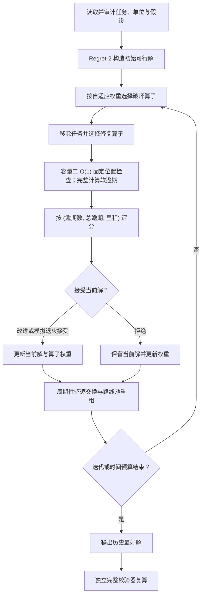

# C2-Lex-HALNS 物流无人机调度算法设计与实验报告

## 摘要

本项目依据[研究与设计决策报告](<deep-research-report (1).md>)实现了容量二、严格词典序的混合自适应大邻域搜索算法 C2-Lex-HALNS，并在用户转换后的 200 任务数据上完成了小规模精确校验、单机压力测试和 8 机集群测试。算法首先最小化逾期任务数，其次最小化总逾期分钟，最后最小化开放路线总里程，因而不会因少飞若干公里而接受更多逾期任务。

在 8 架无人机、每机最多 25 项任务的正式配置下，4 分钟限制内的最好方案在本次勘误数据重跑中用时 66.36 秒，取得词典序得分 **(76 项逾期，2860.03 分钟总逾期，694.69 km)**，按时率为 **62.0%**。相较 Regret-2 初始解，逾期任务减少 32 项，按时率提高 16.0 个百分点，总逾期下降 35.93%，总里程下降 10.45%。该方案的 200 项任务均且仅被服务一次，满足同机取送、先取后送、载荷不超过 2、每机不超过 25 项任务等约束，并通过了不复用搜索缓存的独立校验器。

另一次 1500 轮离线扩展搜索得到 **(67, 2272.19, 641.64)**，但耗时 338.81 秒，超过 4 分钟，因此只作为算法潜力参考，不计为时限内成绩。

## 问题定义与数据解释

每项任务 \(i\) 包含取件点 \(P_i\)、送达点 \(D_i\) 和最晚送达时间 \(T_i\)。无人机从共同起点出发，任务必须由同一架无人机先取后送；任意时刻机上任务数不超过 2；一架无人机承担的任务数不超过 \(K\)；最后一次送达后不计返航。送达时间超过 \(T_i\) 时仍完成任务，并产生软截止期逾期量 \(L_i=\max(0,t_i-T_i)\)。最终方案按下式作严格词典序比较：

\[
\min_{\mathrm{lex}}\left(
\sum_i \mathbf{1}[L_i>0],\quad
\sum_i L_i,\quad
\sum_r d(r)
\right).
\]

附件未给出无人机起点坐标，正式实验明确假定起点为 **(0, 0) km**；命令行参数允许覆盖该值。表头把 `Tmax` 标为分钟，因此将题目速度 15 m/s 换算为 **0.9 km/min**。取送服务时间按 0 分钟处理，所有无人机在 \(t=0\) 独立出发。上述假设被写入每个 JSON 结果，避免单位或起点被隐式解释。

正式求解读取 GB18030 编码的 CSV，原始 `.xls` 和用户转换的 `.xlsx` 同时保留以便审计。本次勘误输入的 CSV SHA-256 为 `386d3fbaa9009aeed947493782d657ed0b30b25d369c8187bfc9619fc7e31d25`，XLS SHA-256 为 `f5e475d1332057466b67502c852e40612259b53bf2ae967ea7fb882693884eb2`，XLSX SHA-256 为 `2c39a150d483ed8b96b4ad550b31bf8344d63883ca25678943d847c19af10c37`。

### 数据审计

| 审计项 | 结果 |
|---|---:|
| 任务数 | 200 |
| 截止期最小值 / 均值 / 中位数 / 最大值 | 20.30 / 37.3675 / 36.45 / 56.50 min |
| 400 个服务节点的无序点对数 | 79,800 |
| 距离小于 1 km 的服务节点对 | 4,311（5.4023%） |
| 服务节点最小距离 | 0.014142 km（D66–P103） |
| 服务节点最大距离 | 9.293681 km（P95–P96） |
| 取送直线距离小于 1 km 的任务 | 11 项 |
| 从 (0,0) 单独执行任务的最小截止期余量 | 12.461511 min |

源研究报告建议模拟数据满足任意节点距离 1–12 km，但正式附件中有 5.4023% 的服务节点对小于 1 km。实现没有截断、平移或重新生成这些坐标，而是保留附件的真实欧氏距离，并在此明确披露差异。最大距离未超过 12 km。

## 算法设计

C2-Lex-HALNS 以 Ropke–Pisinger 的 ALNS 为主体，采用 Psaraftis 三状态动态规划思想构建小规模精确 oracle，借鉴 Gschwind–Drexl 的快速插入检查、Curtois 等的驱逐搜索，以及 Baldacci 等的路线池集合划分思想。实现针对本题的软截止期和容量二结构作了专门调整。



路线缓存记录访问序列的前缀载荷和区间最大载荷。给定一对取送插入位置时，容量可行性通过区间最大值查询在 \(O(1)\) 时间判断，距离增量也由受影响边在 \(O(1)\) 时间计算。由于本题的截止期是软约束，一次插入会改变后续多个任务的逾期状态，候选评分仍完整扫描受影响路线；实现没有把硬时间窗文献中的常数时间可行性结论错误扩展到软逾期目标。

搜索包含 9 个破坏算子：随机、最差距离、最差词典序、空间相关、截止期相关、逾期关键、路线片段、容量冲突和整路线清空；包含 5 个修复算子：贪心、Regret-2、Regret-3、截止期优先和余量优先。算子按近期收益自适应更新轮盘赌权重。模拟退火只用于决定是否替换当前解，历史最好解始终必须严格改善词典序得分。

混合强化包括跨路线驱逐交换和受限路线池重组。搜索期间积累可行路线列，再用带界深度优先集合划分从路线池中选择恰好覆盖全部任务且不超过无人机数的组合。容量二结构主要加速高频插入判断；候选位置剪枝默认每个任务保留 48 个较有希望的位置，以控制 200 任务规模的墙钟时间。

## 正确性验证

自动化测试共 **28 项，全部通过**。测试范围包括 CSV 编码与单位、开放路线距离、先取后送、同机完成、容量和每机任务数限制、缺失与重复任务、非有限输入、无序任务编号的距离矩阵、词典序优先级、最佳成对插入、命令行输入约束、时间预算筛选、JSON 输出与随机种子复现。

小规模求解器使用不丢失精度的 Pareto 标签动态规划，并与随机实例的穷举结果交叉验证。插入缓存在随机路线和有向距离矩阵上与从头复算结果交叉验证。ALNS 还对从 1 到 15 项任务的随机实例执行多种子压力检查。最终 200 任务路线由独立校验器重新遍历访问节点、重算载荷、送达时刻、逾期与距离，而不是直接信任搜索阶段缓存。

## 实验设置

正式实验运行于 Python 3.14.5、macOS 26.5.2、Apple arm64。随机算法使用种子 `2026080500` 至 `2026080504`：单机 25 任务最多运行 1500 轮且总墙钟上限为 120 秒，8 机 200 任务最多运行 400 轮且总墙钟上限为 240 秒；另做一次不受竞赛时限约束的 1500 轮集群扩展搜索。所有算法使用相同的起点、速度、开放路线和目标定义。实验脚本从满足总墙钟上限的运行中选取合规解，若没有运行合规则明确失败，不会把超时解误标为合规结果。

对 5 个随机种子的结果报告均值和 95% Student-t 区间半宽。这些区间仅描述同一实例上的算法随机性；样本量只有 5，且不是 5 个独立问题实例，因此不作正态性检验、不报告 p 值，也不把区间解释为算法对任意数据集的总体性能保证。

## 实验结果

### 小规模精确对照

| 任务数 | Pareto-DP 精确得分 `(逾期数, 总逾期 min, 距离 km)` | DP 时间 | Regret-2 得分 | C2-Lex-HALNS 得分 | HALNS 时间 |
|---:|---:|---:|---:|---:|---:|
| 5 | (0, 0.000, 28.953) | 0.001 s | (1, 1.972, 33.275) | **(0, 0.000, 28.953)** | 0.080 s |
| 8 | (1, 0.643, 46.404) | 0.029 s | (3, 36.628, 59.903) | **(1, 0.643, 46.404)** | 0.171 s |
| 10 | (2, 17.864, 54.646) | 0.287 s | (3, 23.969, 48.400) | **(2, 17.864, 54.646)** | 0.266 s |
| 12 | (3, 65.784, 62.411) | 3.512 s | (6, 97.672, 62.853) | (3, 99.450, 64.185) | 0.385 s |

HALNS 在 5、8、10 任务上复现完整精确词典序最优解；在 12 任务上复现最优逾期任务数，但总逾期比精确解高 33.666 分钟。Regret-2 在 10 任务上的里程虽然比精确词典序解短，但多产生 1 项逾期，因此按题目目标仍是更差方案。这也验证了不能用单一里程或任意固定加权和评价结果。

### 单机 25 任务

| 方法 | 运行数 | 逾期任务数 | 按时率 | 总逾期（min） | 距离（km） | 时间（s） |
|---|---:|---:|---:|---:|---:|---:|
| EDD 相邻取送 | 1 | 21 | 16.0% | 1739.70 | 197.33 | <0.01 |
| 最近邻相邻取送 | 1 | 17 | 32.0% | 1030.95 | 152.76 | <0.01 |
| 全位置贪心插入 | 1 | 15 | 40.0% | 828.04 | 117.67 | 0.01 |
| Regret-2 | 1 | 18 | 28.0% | 875.14 | 126.28 | 0.05 |
| C2-Lex-ALNS，均值 ±95% CI 半宽 | 5 | 13.8 ±0.56 | 44.8% ±2.22 pp | 545.97 ±31.74 | 100.11 ±3.46 | 2.27 ±0.23 |
| C2-Lex-HALNS，均值 ±95% CI 半宽 | 5 | 13.8 ±0.56 | 44.8% ±2.22 pp | 545.97 ±31.74 | 100.11 ±3.46 | 2.28 ±0.23 |
| C2-Lex-HALNS，词典序最好 | 1 | **13** | **48.0%** | 570.34 | 99.45 | 2.02 |

单机只有一条路线，跨路线驱逐与路线池组合没有额外自由度，因此 Basic ALNS 和完整 HALNS 在相同种子下得到相同结果。这一现象符合组件设计，而不是实现未启用。

### 8 机 200 任务

| 方法 | 运行数 | 逾期任务数 | 按时率 | 总逾期（min） | 距离（km） | 时间（s） |
|---|---:|---:|---:|---:|---:|---:|
| EDD 相邻取送 | 1 | 164 | 18.0% | 10563.01 | 1293.99 | 0.01 |
| 最近邻相邻取送 | 1 | 129 | 35.5% | 6892.06 | 943.49 | 0.21 |
| 全位置贪心插入 | 1 | 111 | 44.5% | 4608.69 | 852.05 | 0.41 |
| Regret-2 初始解 | 1 | 108 | 46.0% | 4464.18 | 775.77 | 4.03 |
| C2-Lex-ALNS，均值 ±95% CI 半宽 | 5 | 83.4 ±4.17 | 58.3% ±2.09 pp | 3056.27 ±354.74 | 716.34 ±41.32 | 56.53 ±2.21 |
| C2-Lex-HALNS，均值 ±95% CI 半宽 | 5 | 80.6 ±3.98 | 59.7% ±1.99 pp | 2970.60 ±226.47 | 714.34 ±21.52 | 65.47 ±4.41 |
| C2-Lex-HALNS，4 分钟内最好 | 1 | **76** | **62.0%** | **2860.03** | **694.69** | **66.36** |
| C2-Lex-HALNS，1500 轮离线扩展 | 1 | 67 | 66.5% | 2272.19 | 641.64 | 338.81（超时） |

完整 HALNS 对 Basic ALNS 的逐种子词典序比较为 3 胜、0 平、2 负；其均值少 2.8 项逾期，但由于只有一个问题实例和 5 个种子，证据不足以声称每次运行都稳定优于 Basic 版本。更稳妥的结论是，路线池与驱逐强化在有限预算内具有正向平均效果，但也增加了约 17% 的运行时间和随机波动。

上表采用本次勘误数据 5 种子批量日志中该配置的 66.36 秒墙钟时间；完整路线由同一批量运行直接写入 `best_fleet_solution_compliant.json`，并通过独立合法性校验。该运行低于 240 秒，墙钟时间仅反映本机当次负载，不代表算法结果发生改变。

### 4 分钟内最好方案的逐机结果

| 无人机 | 任务数 | 逾期数 | 总逾期（min） | 距离（km） | 完成时间（min） |
|---:|---:|---:|---:|---:|---:|
| 1 | 25 | 8 | 291.33 | 87.24 | 96.93 |
| 2 | 25 | 9 | 335.91 | 83.93 | 93.26 |
| 3 | 25 | 10 | 351.17 | 87.34 | 97.04 |
| 4 | 25 | 11 | 353.99 | 83.55 | 92.84 |
| 5 | 25 | 12 | 600.00 | 105.16 | 116.84 |
| 6 | 25 | 9 | 310.21 | 82.92 | 92.13 |
| 7 | 25 | 10 | 351.82 | 84.60 | 94.00 |
| 8 | 25 | 7 | 265.62 | 79.95 | 88.84 |
| **合计** | **200** | **76** | **2860.03** | **694.69** | — |

由于 \(N=M\times K=200\)，每架无人机恰好承担 25 项任务。方案的最大单机里程为 105.16 km，最大完成时间为 116.84 分钟，单任务最大逾期为 85.25 分钟。完整访问序列、每项送达时间、算子使用次数和最终权重记录在 [`best_fleet_solution_compliant.json`](results/best_fleet_solution_compliant.json) 中。

表中合计由未舍入原始值计算，因此可能与逐行显示到两位小数后的数值之和存在微小舍入差异。

## 结论与限制

实验支持三点结论。第一，严格词典序目标确实改变了搜索偏好；小规模例子中，里程更短的方案可能因为多一项逾期而被正确拒绝。第二，截止期感知破坏/修复与自适应搜索相较简单构造法大幅改善了按时率，正式最好解相较 Regret-2 多按时完成 32 项任务。第三，离线扩展还能把逾期数从 76 降到 67，说明更长预算仍有改进空间，但不能作为 4 分钟成绩。

结果仍有明确边界。起点坐标和服务耗时不是附件字段，当前结论依赖 `(0,0)` 与零服务时间假设；如果赛方给出不同起点或作业时间，应重新运行。统计只覆盖一个 200 任务实例和 5 个随机种子，不足以建立跨实例显著性。精确 DP 的状态空间呈指数增长，目前仅用于小规模 oracle，不能证明 200 任务解的全局最优性。附件还不满足研究报告提出的所有节点间距至少 1 km 的模拟数据条件，因此本报告结果只代表所附真实坐标，不代表该模拟分布。

## 复现方法与产物

从仓库根目录执行测试：

```bash
python3 -m pip install -r requirements-dev.txt -e .
PYTHONPATH=algorithm/src python3 -m pytest algorithm/tests
```

复现 4 分钟内最好配置：

```bash
PYTHONPATH=algorithm/src python3 -m uav_dispatch solve \
  --input 'algorithm/命题1-低空经济场景下的物流无人机调度算法数据.csv' \
  --method halns --tasks 200 --drones 8 --max-tasks 25 \
  --iterations 400 --time-limit 240 --seed 2026080504 \
  --output algorithm/results/solution.json
```

复现完整基准（包含超时离线扩展）：

```bash
PYTHONPATH=algorithm/src python3 algorithm/experiments/run_benchmarks.py \
  --output-dir algorithm/results --seed-count 5 \
  --single-iterations 1500 --single-time-limit 120 \
  --fleet-iterations 400 --fleet-time-limit 240 \
  --extended-iterations 1500
```

原始逐次运行位于 [`benchmark_runs.csv`](results/benchmark_runs.csv)，汇总统计位于 [`benchmark_summary.csv`](results/benchmark_summary.csv)，环境、设置、数据审计和所有结果的机器可读版本位于 [`benchmark_results.json`](results/benchmark_results.json)。4 分钟内方案为 [`best_fleet_solution_compliant.json`](results/best_fleet_solution_compliant.json)；[`best_fleet_solution.json`](results/best_fleet_solution.json) 是 338.81 秒的离线扩展方案，不应混作时限内结果。
