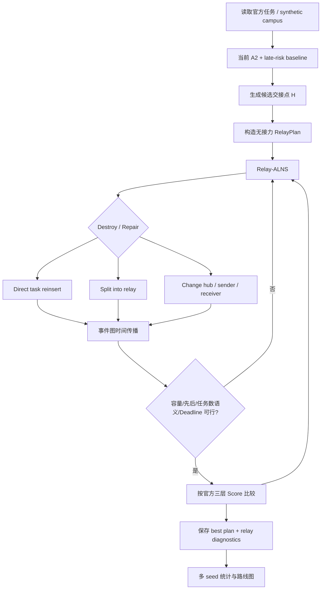

# JD_WuLiuBei 引入“接力交接”机制的数学可行性、算法路线与 Codex 实施方案

## 执行摘要

**结论先说：这个方向值得做，而且从“继续微调 ALNS 邻域”转向“改变任务执行机制”在方法论上是正确的；但你们当前题目约束里藏着一个非常关键的数学障碍。**

截至 2026 年 8 月 10 日，我核对了仓库当前非 `main` 的主要迭代分支。演进大致是 `codex/uav-alns-dispatch` → `codex/alns-core-comparison` → `codex/stronger-uav-neighborhoods` → `feature/capacity-aware-halns` → `feature/adaptive-deadline-rejection-pool`；最新报告已经把这些分支的正式实验统一到题目的三层词典序指标——逾期任务数、总逾期分钟、总里程——进行比较。fileciteturn14file0L2-L2 当前最新推荐配置 `A2 + late-risk destroy` 的三种子 240 秒均值为 `(68.667, 2310.280, 645.854)`，而此前 A2、ALNS Core 一类方案已经大体停留在平均约 69–70 个逾期任务这一档；VND、cluster repair、route pool、rejection pool、soft-deadline package 等进一步增强反而普遍降低了固定墙钟下的结果。fileciteturn13file0L2-L2 fileciteturn14file0L2-L2 因而你们所说的“算法设计优化的边际效益越来越小”，与仓库实际实验轨迹是相符的。

更重要的是，接力不是一个普通的新邻域算子。当前 `Task` 在代码里被定义成不可分割的 pickup-delivery 请求，正访问编号表示取件、负编号表示送件；验证器要求同一路线上先取后送、容量不超过 2，并按每架无人机路线出现的不同任务数量检查 `max_tasks_per_drone`。fileciteturn15file0L2-L2 fileciteturn16file0L2-L2 **接力会直接打破“一个任务只能属于一条路线”这一状态表示，因此它是模型层面的扩维，而不是再往 `alns.py` 里塞一个 destroy/repair。**

但这里有一个决定成败的约束：

> 当前正式实例为 \(N=200\)、\(M=8\)、每架最多 \(K=25\) 个任务，所以 \(MK=N=200\)，没有任何任务槽位富余。当前 README 与正式实验均使用这一配置。fileciteturn12file0L2-L2 fileciteturn14file0L2-L2

设接力任务数为 \(R\)，若题目把“某架无人机只要参与了一个任务的一段运输”都算作该无人机承接过这个任务，则任务—无人机关联总数 \(I\) 至少满足 \(I\ge N+R\)。而每架最多 \(K\) 个任务给出 \(I\le MK=200=N\)。于是立即得到 \(R=0\)。

**也就是说：按照当前验证器最自然、最严格的解释，官方 200 任务实例上数学上一个接力任务都不允许存在。**

这不是算法不好，而是可行域本身把接力排除了。

因此我建议把研究分成两条同时进行的轨道：

| 轨道 | \(K=25\) 的解释 | 官方 200 任务上能否接力 | 用途 |
|---|---|---:|---|
| **Strict-touch** | 一个任务被两架机处理，就分别占两架机的任务额度 | **不能，严格证明 \(R=0\)** | 题意保守解释、风险审计 |
| **Primary-owner** | 原始订单只计一次“承接任务数”，第二架机只是执行接力段 | **可以** | 你们拟提出的新方法论模型 |
| Segment-workload | 不再按原订单计数，而按飞行段/工作量限制 | 可以 | 学术扩展，不宜直接宣称符合原题 |

我的核心算法建议不是一开始做“空中动态会合”，而是：

> **先做“允许暂存的静态/候选点接力 + Relay-ALNS”，证明接力本身有价值；然后升级成“动态选择交接点”，最后才研究连续空间中的动态会合。**

这与成熟的 Pickup-and-Delivery with Transfers 文献非常一致。Masson、Lehuédé、Péton 的经典 PDPT 工作允许请求在指定 transfer points 更换车辆，并把专门的 transfer insertion heuristic 嵌入 ALNS，在其真实案例中报告过最高约 9% 的目标改善；这个数字不能直接外推到你们实例，但至少证明“改变同一订单必须同机完成的机制”确实可能带来非微小的结构性收益。citeturn7search0 Cortés 等更早给出了固定 transfer station 的严格数学模型与 branch-and-cut，说明这是一个明确的优化问题族，而不是经验性的“外卖接力”比喻。citeturn3search0

尤其值得注意的是，Sampaio 等研究的货物接力允许一名司机在 transfer location 放下包裹，由另一名司机**之后**再取走，而非要求两人同时抵达；他们用 ALNS 同时寻找有价值的 transfer opportunity 与路线，在特定空间和服务约束下得到明显的系统收益。这个“可暂存、异步交接”的设定，几乎正好对应“外卖到校门、校内骑手稍后取件”的现实逻辑。citeturn7search4turn7search5

所以我对这个方向的判断是：

**值得投入，优先级高于继续堆 ALNS 局部邻域；但真正值得做的是“异步静态/候选点中转 + 路线联合优化”，而不是直接做连续动态会合。**

## 仓库演进与当前结构性瓶颈

你们的仓库已经形成了比较清晰的迭代链。早期 `codex/uav-alns-dispatch` 建立 C2-Lex-ALNS/HALNS；`codex/alns-core-comparison` 在统一墙钟预算下比较 Core 与 HALNS；`codex/stronger-uav-neighborhoods` 增加 assignment destroy、deadline risk、VND、cluster repair、ejection、route pool 等并进行逐项消融；后续又尝试 capacity-aware 与 adaptive deadline/rejection pool。最新报告明确列出了这些非 `main` 分支，并对相同 200 任务、3 个固定 seed、每次 240 秒的正式结果进行了统一审计。fileciteturn14file0L2-L2

最能说明边际效益下降的是问题特定邻域实验。A0 到 A2 尚有小幅改善：A0 平均 `(70.333, 2338.919, 647.610)`，A2 为 `(70.000, 2321.448, 643.948)`；但再启用 VND、cluster repair、ejection、route pool 后，每秒搜索轮数明显下降，最终三项指标反而普遍恶化。例如 A2 约 7.094 iterations/s，而 A6 只有约 3.092 iterations/s，同时平均逾期任务数从 70 上升到 75。fileciteturn13file0L2-L2 这意味着现在的瓶颈并不只是“邻域还不够聪明”，而是**搜索仍被限制在同一个任务表示和同一个可行解拓扑里**。

最新 adaptive 实验又验证了这一趋势。当前 `A2 + late-risk destroy` 确实把三种子平均逾期数推进到了 68.667，但 rejection pool、soft deadline 以及三个模块组合分别恶化到 74.000、74.333、76.333。fileciteturn14file0L2-L2 从研究设计角度看，这正是适合改变问题结构而不是继续调启发式参数的阶段。

当前代码结构也非常适合进行“平行扩展”而不是彻底推倒重写。最新实验分支已经把主要实现分成 `model.py`、`io.py`、`validation.py`、`search.py`、`exact.py`、`alns.py`、`cli.py`，并具有独立实验脚本、结果目录和 pytest 测试集。fileciteturn11file0L2-L2 README 给出的正式运行入口仍然是：

```bash
PYTHONPATH=algorithm/src python3 -m uav_dispatch solve \
  --input 'algorithm/命题1-低空经济场景下的物流无人机调度算法数据.csv' \
  --method halns --tasks 200 --drones 8 --max-tasks 25 \
  --iterations 400 --time-limit 240 --seed 2026080504 \
  --output algorithm/results/solution.json
```

对应模型使用容量 2、速度 `0.9 km/min = 15 m/s`、开放路线、所有无人机从同一 depot 在 \(t=0\) 出发，最终方案依次最小化 `late_count → total_lateness_min → distance_km`。fileciteturn12file0L2-L2

当前最关键的建模限制在 `model.py` 和 `validation.py`：

当前任务只有 `pickup` 与 `delivery` 两个地点，没有 `handoff_drop` 和 `handoff_pick` 两种事件；`Problem.distance()` 也只面向 depot、pickup 和 delivery 节点。fileciteturn15file0L2-L2 验证器则在每一条无人机路线内部维护 `picked`、`delivered`、`load`，如果该路线出现 delivery 而之前没有在**同一条路线** pickup 就直接判违规。fileciteturn16file0L2-L2

因此例如

```text
Drone A: depot -> pickup_i -> handoff_i
Drone B: depot -> handoff_i -> delivery_i
```

在现有模型中根本无法合法表示。

我的建议是**不要直接修改 signed-int visit 语义**，否则很容易把现在已经稳定的 baseline、缓存和全部测试一起破坏。应新建一套 relay event 层，然后让无接力的旧解可以无损映射到 relay event 解。

建议的新状态是：

```text
PICKUP(i)
HANDOFF_DROP(i, h)
HANDOFF_PICK(i, h)
DELIVERY(i)
```

每个接力订单的物权/载荷演化变成：

```text
无人机 A: 0 -> PICKUP(i) 载荷 +1
             -> HANDOFF_DROP(i,h) 载荷 -1

交接点 h:   包裹进入等待队列

无人机 B:   ... -> HANDOFF_PICK(i,h) 载荷 +1
                 -> DELIVERY(i)       载荷 -1
```

这种方式会把你们的模型从普通 PDPTW 扩展为 **PDPTW with Transfers / Two-Echelon Relay Routing**。相关研究已经证明，transfer 会产生新的同步、装载与路径耦合难题，ALNS 是这一问题族中很自然的工程求解方式。citeturn7search0turn7search4

仓库自身其实也已经收录了诸如 `Transfer Optimization for Heterogeneous Drone Delivery and Pickup Problem`、two-echelon vehicle routing with drones、flexible launch/recovery 等相关论文文件，这说明接力/转运并不是与你们已有文献体系割裂的新方向，而是可以自然接到原有 truck-drone、multi-drone、transfer 研究线上。fileciteturn11file0L2-L2

## 数学可行性与“什么时候接力真的会更优”

**最重要的第一结论，是接力不会凭空缩短一个订单自身的几何运输距离。**

设订单 \(i\) 的取件点为向量 \( \mathbf{p}_i \)，送达点为 \( \mathbf{d}_i \)，交接点为 \( \mathbf{h} \)。如果距离是欧氏距离，则三角不等式保证

\(d(\mathbf{p}_i,\mathbf{h})+d(\mathbf{h},\mathbf{d}_i)\ge d(\mathbf{p}_i,\mathbf{d}_i)\)。

所以如果只看一个孤立订单，从 pickup 飞到 handoff 再飞到 delivery 绝不会比直接 pickup → delivery 更短。

**接力的收益一定来自“车辆路线层面的重组”，而不是包裹自身路径变短。**

例如无人机 A 当前从节点 \(u\) 到 \(v\)，无人机 B 从 \(r\) 到 \(s\)。若把订单 \(i\) 分成 A 的 `pickup → hub` 和 B 的 `hub → delivery`，一个非常有用的局部筛选量是

\( \Delta_{\rm relay}=[d(u,\mathbf{p}_i)+d(\mathbf{p}_i,\mathbf{h})+d(\mathbf{h},v)-d(u,v)] + [d(r,\mathbf{h})+d(\mathbf{h},\mathbf{d}_i)+d(\mathbf{d}_i,s)-d(r,s)] \)。

若当前把完整 pickup-delivery pair 插入任意单架无人机的最好增量为 \(\Delta_{\rm same}^{*}\)，那么至少在局部距离意义下，只有当 \(\Delta_{\rm relay}<\Delta_{\rm same}^{*}\) 时，接力才值得进入完整可行性检查。

这恰好解释“校门接力”为什么可能有效。

假设大量 pickup 聚集在区域 A，而 delivery 聚集在区域 B。如果所有订单必须同一骑手完成，那么每个骑手都要反复跨越 A/B 边界；引入交接点后，A 侧骑手可以集中完成 pickup → gate，B 侧骑手可以集中完成 gate → destination，使车辆路线形成空间分工。Masson 等的 transfer-PDP、Sampaio 等的 crowdsourced transfer 研究都发现：transfer 的价值特别来自车辆时间、服务区域、路线限制等异质性，而不是单个请求几何距离的缩短。citeturn7search0turn7search4

中国现实的多阶段配送也有类似结构。2025 年一项面向无人机与人工骑手协同外卖的研究把订单划分为“骑手 → launchpad → drone → kiosk → 骑手”多段，并把设施选址、订单分配和交接等待一并建模；其案例显示协同方式可以降低运营成本和骑手需求，但 transfer detour 与排队等待也可能让较短订单的送达时间变长。citeturn4view2 这对你们特别重要：**接力不是无条件有效，必须显式把交接等待时间纳入 deadline。**

我建议对静态交接先使用“可缓存交接点”而不是“双机必须同时到达”。

设上游无人机在 hub 放下订单 \(i\) 的时间为 \(t_i^{\rm drop}\)，下游无人机取走时间为 \(t_i^{\rm pick}\)。只要求 \(t_i^{\rm pick}\ge t_i^{\rm drop}+\tau_h\)，其中 \(\tau_h\) 是交接操作时长。包裹等待为 \(w_i=t_i^{\rm pick}-t_i^{\rm drop}-\tau_h\)。

这对应现实中的校门货架、柜体、人员暂存区。Sampaio 等的 transfer 模型也允许包裹由一名司机放置后再由另一司机稍后取走，因此比强制 simultaneous rendezvous 更接近你们的灵感。citeturn7search4turn7search5

还有一个非常漂亮的实现方式：**把整个接力调度看成事件优先图。**

每架无人机自己的路线产生时间先后边，例如 `event_j → event_{j+1}`；每个交接订单再增加一条 `HANDOFF_DROP → HANDOFF_PICK` 的跨无人机先后边。只要这个事件图无环，就可以按拓扑顺序计算所有事件的最早发生时刻；若出现诸如“A 等 B 的包裹，而 B 后面又等 A 的另一个包裹”的正时间环，就判为不可行。

对一个固定 relay plan，这一完整时间传播只需对事件图做一次拓扑排序/最长路，复杂度是事件和依赖边数量的线性级别。它比在 ALNS 每次 move 中通过模拟两个无人机“互相等”来处理同步更干净。

由此可以得到一个很明确的收益条件：

| 条件 | 对接力的影响 |
|---|---|
| pickup、delivery 有明显空间分区 | 强正向 |
| 大量订单的路线跨越同一个“边界” | 强正向 |
| 截止时间紧、某一区域任务拥堵 | 正向，接力可改变订单优先级传播 |
| 单架容量仅为 2 | **可能正向**，因为接力可以更早释放上游载荷 |
| 所有无人机完全同质、同一 depot、空间随机均匀 | 接力收益会显著减弱 |
| handoff 操作时间或等待时间大 | 负向 |
| handoff 点偏离自然流向 | 负向 |
| 每个订单允许多次接力 | 搜索空间暴涨，首版不值得 |
| `strict-touch` 且 \(N=MK\) | **严格无法接力** |

这里“容量 2”反而是你们比较有利的地方。当前一件包裹从 pickup 一直占用载荷直到 delivery；如果它在 hub 提前卸下，上游无人机可以更快释放一个容量槽位，再去取另一个紧 deadline 订单。这种收益不一定降低总距离，却可能降低你们最重要的第一层目标——逾期任务数。当前题目的评分首先比较逾期任务数量，而不是距离，因此只要接力让一个订单从逾期变成准时，即使产生了一点额外里程，它依然可能严格优于原方案。当前代码的 `Score` 也确实以 `late_count → total_lateness → distance` 的顺序实现。fileciteturn15file0L2-L2

因此对你们的实际实例，我的预期不是“接力主要把 645 km 降到多少”，而是：

> **最有希望出现突破的是第一目标 `late_count`，其次是 total lateness；distance 很可能改善较小，甚至略有增加。**

这与最新分支里一些优化已经表现出的现象相符：严格词典序下不能为了减少距离而容忍更多逾期，而当前最好的 late-risk 方案本身也不是距离最低的方案。fileciteturn14file0L2-L2

## 算法方向与推荐模型

我建议把“接力”分为四个层级，不要一次性做最复杂版本。

| 方案 | 交接点位置 | 是否允许暂存 | 主要决策 | 搜索成本 | 推荐度 |
|---|---|---:|---|---|---|
| R0 当前 baseline | 无 | — | 单机完成 pair | 当前水平 | 对照 |
| **R1 单/多静态 hub** | 预先固定 | 是 | 是否接力、在哪个 hub、两架机、两段顺序 | 中等 | **第一优先** |
| **R2 动态选择候选 hub** | 候选集合固定，但每个订单动态选 | 是 | R1 + hub activation/assignment | 中高 | **第二优先** |
| R3 自适应生成 hub | 搜索过程中生成坐标候选 | 是 | R2 + hub 坐标局部优化 | 高 | 第三阶段 |
| R4 连续移动会合 | 任意 \( \mathbf{h} \) | 通常否 | 连续会合点 + 两机同步 | 极高 | 暂不建议 |

这种先静态、后动态的路线也有文献依据。固定 transfer points 的 PDPT 已有严格数学模型和 ALNS 方案；后续研究发现 transfer 会显著增加组合复杂度，一些工作甚至选择预先确定 transfer 决策再求普通 PDP，以绕开搜索膨胀。citeturn3search0turn7search3

**第一阶段：Buffered Static Relay-ALNS。**

每个任务最多零次或一次接力。决策可以抽象为：

- \(z_i\in\{0,1\}\)：订单 \(i\) 是否接力；
- \(q_{ih}\in\{0,1\}\)：若接力，是否使用 hub \(h\)；
- \(a_i,b_i\)：前半段与后半段的无人机；
- 各无人机上的 event sequence；
- 每个 event 的时间；
- 每个 hub 的包裹库存状态。

约束包括：原始 pickup 先于 handoff drop；handoff drop 先于 handoff pick；handoff pick 先于 delivery；容量始终 \(\le2\)；最终每个任务恰好完成一次；deadline 根据最终 `DELIVERY` 时间计算；若配置 hub capacity，则任意时刻库存不得超过上限。

**官方评分不要改。**

仍然只使用

```text
(late_count, total_lateness_min, distance_km)
```

判断方案优劣。

另行记录但不进入官方前三层的：

```text
relay_count
package_wait_min
uav_wait_min
handoff_operation_min
max_hub_inventory
relay_distance_km
direct_task_count
```

可以在**官方三项完全相同以后**再用 `relay_count` 和 waiting 作为搜索 tie-break，以避免得到不必要的复杂接力方案，但绝不能把它们加权到官方三项前面。当前仓库经过几轮实验已经刻意避免固定权重破坏词典序，这一点应该继续保持。fileciteturn12file0L2-L2

建议的 Relay-ALNS 邻域为：

| 类别 | 操作 | 作用 |
|---|---|---|
| 创建接力 | `split_task_to_relay` | direct task → 两机接力 |
| 删除接力 | `merge_relay_to_direct` | 防止接力数量只增不减 |
| 换接收机 | `change_receiver_drone` | 调整后半段任务区域 |
| 换发送机 | `change_sender_drone` | 调整前半段任务区域 |
| 换 hub | `change_handoff_point` | 静态多 hub 选择 |
| Relay destroy | 优先移除高 lateness / 高 wait 的接力或直送任务 | 大尺度重组 |
| Cross-boundary repair | 根据 pickup/hub/delivery 空间分工重新插入 | 专门寻找接力机会 |
| Relay pair swap | 两个任务交换上下游无人机 | 满载 \(K\) 场景尤其重要 |

经典 PDPT 的 ALNS 正是通过针对 transfer 的插入启发式解决“一个订单被两条路线共同服务”的问题，因此在你们现有 ALNS 框架上继续扩展比换遗传算法或强化学习更自然。citeturn7search0 Ropke–Pisinger 的经典 ALNS 本身也表明，多个相互竞争的 destroy/repair 子启发式通过历史表现自适应选择，是 PDP 大实例中非常有效的结构。citeturn3search12

**复杂度方面不要穷举所有 relay insertion。**

若一条路线长度约为 \(L\)，hub 数为 \(H\)，无人机数为 \(M\)，上游需要选择 pickup/drop 两个位置，下游又需要选择 hub-pick/delivery 两个位置。最朴素的单任务穷举接近 \(O(HM^2L^4)\)，在 ALNS 的每轮 repair 里会非常贵。

建议采用二阶段候选生成：

先分别寻找某个 `(task, hub, drone)` 上最好的前半段和后半段插入，分别只保留前 \(B\) 个候选，再组合两个候选列表。这样一轮单任务筛选大致可以降到 \(O(HML^2+HM^2B^2)\)。取 \(B=8\sim16\)、\(H=2\sim8\) 时，比四层位置枚举容易控制得多。当前仓库已经有 candidate-limit 与路线缓存思路，因此这是沿用现有工程哲学，而不是另起炉灶。fileciteturn12file0L2-L2

**第二阶段才做动态 hub。**

这里我建议你们把“动态”拆成两个概念：

一是**位置集合固定、订单动态选择交接点**。比如校门 A/B/C 都是合法交接区，但 ALNS 为每个订单选择不同 gate。这个其实已经能体现“动态交接”。

二是**交接点坐标本身动态变化**。这时可让搜索根据当前两条路线生成一个局部候选 \( \mathbf{h} \)，而不是直接做连续非线性优化。例如：

```text
当前最佳 hub
     ↓
周围 3×3 coarse grid
     ↓
选最优点
     ↓
缩小半径
     ↓
重复 2~3 层
```

或者根据两条路线的相邻节点、pickup/delivery cluster 生成有限 candidate points，再运行同一个 Relay-ALNS。这能保留可复现性，也不需要给当前没有第三方运行依赖的项目硬塞一个复杂非线性求解器；当前 `pyproject.toml` 的运行时依赖确实为空。fileciteturn17file0L2-L2

真正的“无人机 A 和 B 在空中某坐标同时碰面交货”应放在最后。它要求同时决定两架路线、两个 arrival time 与连续向量 \( \mathbf{h} \)，而且交接失败风险也明显高于有缓存的固定节点。在你们的竞赛研究叙事里，**校门/集散节点接力本身已经足够构成清晰的方法创新，不必为了“动态”两个字先把最难的同步问题引进来。**

整体算法结构建议如下：



中国文献里也有很相近的“两阶段选址—路径联合优化”思路。例如 2025 年《铁道科学与工程学报》一项“外集内配”研究先用加权聚类完成物流节点选址分配，再结合时间窗协调第二阶段路径，这可以作为你们“先定候选 handoff facilities，再做路由”的中文方法学旁证；不过它研究的是公铁联运选址—路径，不是你们这个无人机 transfer-PDP，因此只能作为方法结构的类比。citeturn5search0

## 实验设计、统计检验与最终可视化

实验必须分成**题目官方实例**和**特意构造的 campus/relay 场景**。只跑官方一份 200 任务数据是不够的：如果这份数据空间结构接近随机均匀，同质无人机又从同一 depot 出发，那么接力很可能天然缺乏发挥空间；这不能证明“接力无价值”，只能证明“该实例没有明显 transfer structure”。反过来，也绝不能只在为接力量身定做的 synthetic gate 实例上取得巨大收益就宣称官方问题被改善。

建议正式比较如下。

| 代码 | 方法 | 目的 |
|---|---|---|
| B0 | 当前 `A2 + late-risk destroy` | 最新 no-relay baseline |
| B1 | Relay representation，`relay disabled` | 验证新模型不改变旧问题 |
| R1 | 单固定 hub + buffered relay | 最小接力机制 |
| R2 | 多固定 hub + Relay-ALNS | **主推荐方案** |
| R3 | R2 + adaptive hub selection | 测动态选择收益 |
| R4 | R3 + locally generated hubs | 测动态位置是否值得复杂度 |
| R5 | strict-synchronization relay | 只做消融，不做默认 |

**官方数据实验。**

仍使用仓库里的 `algorithm/命题1-低空经济场景下的物流无人机调度算法数据.csv`，保持 `M=8`、`K=25`、capacity=2、speed=`0.9 km/min`，正式比较至少复用旧实验的 seeds `2026080500`、`2026080501`、`2026080502` 与每次 240 秒墙钟预算，这样才能和现有分支历史结果直接对齐。当前仓库的正式报告就是用这一口径做跨分支主表。fileciteturn14file0L2-L2

官方数据必须同时跑：

```text
task_count_semantics = strict-touch
task_count_semantics = primary-owner
```

其中 strict-touch 的价值不是“期待优化”，而是把前面的计数定理做成程序化审计：在 `N=M*K` 的情况下，任何强制 relay 应被 validator 拒绝。

**Synthetic campus 数据。**

建议生成四类场景：

| 场景 | 空间结构 | 接力理论预期 |
|---|---|---|
| U | pickup/delivery 均匀随机 | 负对照，低收益 |
| G | pickup 在“校外”，delivery 在“校内”，中间有 gate cut | 高收益 |
| MZ | 4–8 个宿舍/教学楼 cluster + 2–4 gate/hub | 中高收益 |
| MIX | 既有同区订单，也有跨区订单 | 最接近现实 |

规模使用 \(N\in\{25,50,100,200\}\)。舰队可以按 `ceil(N/25)` 扩展；容量继续为 2。单无人机问题不需要做接力，因为只有一架执行载体时，“换无人机”本身不存在，接力机制主要属于多无人机子问题。

Synthetic 距离最好不要简单把坐标欧氏距离强行 clamp 到 `[1,12]`，因为那会破坏度量结构。更好的做法是先生成 campus graph/coordinate metric，再把所有非零最短路统一仿射映射到 `[1,12] km`；坐标本身继续用于路线图显示，而求解使用规范化距离矩阵。

建议参数矩阵：

| 因素 | 建议值 |
|---|---|
| hub 数 \(H\) | 1, 2, 4, 8 |
| handoff 操作时间 \(\tau_h\) | 0, 0.5, 1, 2 min |
| 最大包裹等待 | ∞, 5, 10, 20 min |
| hub capacity | ∞, 2, 5, 10 |
| 允许接力订单比例 | 25%, 50%, 100% |
| 每单最大接力次数 | **1** |
| synthetic seeds | 至少 10 |
| 正式官方 seeds | 先保持历史 3 seeds，并另做更多 seed 稳健性检查 |
| 正式官方预算 | 240 s |
| quick/smoke | 小规模、短预算，只用于验证程序 |

特别值得做一个 **handoff overhead × hub count** 的二维扫描，因为它直接告诉评委：

> “交接不是越多越好，在多大交接成本以内接力机制才有系统收益？”

这比单独报“新算法比 baseline 好一点”更有研究价值。

统计上不要把三个词典序指标加权成一个综合分数。当前仓库一直在避免这样做，应该保持。fileciteturn14file0L2-L2

建议正式报告：

- 每个 matched seed 的词典序 win / tie / loss；
- 对“接力方案是否词典序赢 baseline”做 exact sign test；
- 对 `late_count`、`total_lateness`、`distance` 分别给 paired difference 与 bootstrap 95% CI；
- 多组参数比较时对 p 值做 Holm correction；
- 同时报告中位数、均值、IQR，不只报最佳 seed；
- 不允许把某个幸运 seed 的 65/66 个逾期订单当成算法均值。

接力领域文献也强调 transfer 的收益高度依赖 transfer location 数量和地理分布、车辆限制与客户分布，Sampaio 等的计算实验就专门对这些实例特征进行了分析。citeturn7search5 因而这里的 sensitivity study 不是附加项，而是研究接力机制“为何有效”的核心。

**可视化必须在正式实验全部结束后统一生成，不能边跑边手工挑图。**

建议至少输出：

| 图 | 内容 | 回答的问题 |
|---|---|---|
| convergence time-series | 三层 best-so-far 随 wall-clock | relay 是否只是更慢 |
| boxplot | 不同方法各 seed 的 late_count/lateness/distance | 稳健性 |
| heatmap | hub count × handoff time 的 Δlate_count | 接力有效区域 |
| route map | baseline 与 relay 的无人机路线 | 接力怎样改变空间分工 |
| custody map | 某接力订单由 Drone A → Hub → Drone B | 方法机制 |
| hub inventory timeline | hub 随时间的包裹数量 | 缓存是否现实 |
| waiting distribution | package/UAV waiting | 同步代价 |
| relay-rate plot | 不同 deadline tightness 下接力比例 | 哪些任务更适合 relay |

路线图最好把普通 pickup-delivery、handoff drop、handoff pick 使用不同 marker，并在接力订单上标注 task id。不能只画“总指标柱状图”，否则评委很难看到方法论变化。

建议新增：

```text
algorithm/experiments/generate_relay_scenarios.py
algorithm/experiments/run_relay_handoff.py
algorithm/experiments/plot_relay_handoff.py
```

统一命令设计成：

```bash
# quick
PYTHONPATH=algorithm/src python3 \
  algorithm/experiments/run_relay_handoff.py \
  --quick \
  --output-dir algorithm/results/relay_handoff/smoke

# 官方正式
PYTHONPATH=algorithm/src python3 \
  algorithm/experiments/run_relay_handoff.py \
  --dataset official \
  --methods baseline static-1hub static-multihub adaptive-hubs \
  --seeds 2026080500 2026080501 2026080502 \
  --time-limit 240 \
  --task-count-semantics primary-owner \
  --output-dir algorithm/results/relay_handoff/official

# strict 语义审计
PYTHONPATH=algorithm/src python3 \
  algorithm/experiments/run_relay_handoff.py \
  --dataset official \
  --methods baseline static-multihub \
  --task-count-semantics strict-touch \
  --output-dir algorithm/results/relay_handoff/strict_audit

# synthetic campus
PYTHONPATH=algorithm/src python3 \
  algorithm/experiments/run_relay_handoff.py \
  --dataset synthetic \
  --scenario all \
  --tasks 25 50 100 200 \
  --hub-counts 1 2 4 8 \
  --handoff-times 0 0.5 1 2 \
  --seed-count 10 \
  --output-dir algorithm/results/relay_handoff/synthetic

# 所有实验结束后统一出图
PYTHONPATH=algorithm/src python3 \
  algorithm/experiments/plot_relay_handoff.py \
  --input-dir algorithm/results/relay_handoff \
  --output-dir writing/figures/relay_handoff
```

当前项目运行依赖为空，pytest 作为开发环境工具存在，因此建议不要为画图污染核心 solver 依赖，而是新建独立的 `requirements-analysis.txt`，放 `matplotlib`、`pandas`、`scipy` 等实验分析依赖。fileciteturn17file0L2-L2

## 实现路径与 Git 分支工作流

**Codex 应当做 git 操作，不是你本人执行。**

目前 `feature/adaptive-deadline-rejection-pool` 是我检查到的最新实验分支之一，其 2026 年 8 月 10 日的 tip 已经包含跨分支正式指标审计。fileciteturn10file0L2-L2 因此在当前状态下，我建议 Codex 从这个分支作为基线，而不是从较旧的 `main` 重新开始。不过执行时仍然应该先 `git fetch` 并按提交日期审计远端，因为你们遵循“一次迭代一个 branch”，Codex 真正运行时可能又多了新分支。

建议顺序：

```text
origin/feature/adaptive-deadline-rejection-pool
              │
              ▼
feature/relay-handoff-core
              │
              ▼
feature/relay-static-buffered
              │
              ▼
feature/relay-adaptive-hubs
              │
              ▼
experiment/relay-campus-study
```

这样每一阶段本身就是一次可回滚的迭代，完全符合你们现在的仓库方法。

**第一分支 `feature/relay-handoff-core`：只做表示与验证，不追求优化。**

建议新建：

```text
algorithm/src/uav_dispatch/relay.py
algorithm/src/uav_dispatch/relay_validation.py
algorithm/tests/test_relay_model.py
algorithm/tests/test_relay_validation.py
algorithm/reports/relay_task_count_semantics.md
```

尽量暂时不改旧 `Task` 的 signed-int 语义；`relay.py` 建一个 `RelayProblem(base_problem=...)` 包装层。这样 `--relay disabled` 时，老 solver 完全不动。

验收条件：

```text
1. 把旧路线转成 no-relay RelayPlan 后，Score 与旧 validator 完全一致；
2. PICKUP -> DROP -> PICK -> DELIVERY custody 顺序正确；
3. capacity=2 始终检查；
4. event precedence graph 能发现跨无人机同步环；
5. strict-touch 在 N=200,M=8,K=25 时任何强制 relay 必须失败；
6. primary-owner 模式必须明确标记为题意扩展，不能偷偷当成原始语义；
7. 现有 algorithm/tests 全部继续通过。
```

**第二分支 `feature/relay-static-buffered`：实现真正的第一版算法。**

新增：

```text
algorithm/src/uav_dispatch/relay_search.py
algorithm/src/uav_dispatch/relay_alns.py
algorithm/tests/test_relay_search.py
algorithm/tests/test_relay_alns.py
```

修改：

```text
algorithm/src/uav_dispatch/cli.py
algorithm/src/uav_dispatch/__init__.py
```

必要时只做最小修改：

```text
algorithm/src/uav_dispatch/search.py
algorithm/src/uav_dispatch/alns.py
```

目标是支持：

```text
--method relay-alns
--relay-mode static-buffered
--relay-hubs ...
--max-handoffs-per-task 1
--handoff-service-min ...
--relay-task-count-semantics ...
```

这一阶段必须先做固定单 hub，然后多 hub。不要同时写 adaptive continuous point。

**第三分支 `feature/relay-adaptive-hubs`：动态交接点。**

先实现“从候选点集合动态选择”，再实现局部候选坐标生成。不能直接跳到连续双机 rendezvous。

建议增加：

```text
algorithm/src/uav_dispatch/handoff_points.py
algorithm/tests/test_handoff_points.py
```

包含：

```text
fixed user hubs
flow-weighted medoid hubs
gate/boundary hubs
local grid-refined hubs
```

2022 年的一项多无人机自动装置配送研究也采用了“先任务/设施层分配，再局部路径规划”的两阶段策略，并在其试验中相对于所比较方法获得明显成本改进，说明“先解决空间分区，再做航线”的框架对 drone pickup-delivery 是合理研究方向。citeturn3academia24

**最后分支 `experiment/relay-campus-study`：只放正式实验、图和研究结论。**

新增：

```text
algorithm/experiments/generate_relay_scenarios.py
algorithm/experiments/run_relay_handoff.py
algorithm/experiments/plot_relay_handoff.py
algorithm/tests/test_relay_experiment.py

algorithm/results/relay_handoff/
algorithm/reports/relay_handoff_report.md

writing/figures/relay_handoff/
writing/tables/relay_handoff/
requirements-analysis.txt
```

正式 commit 应分开：

```text
feat: add relay handoff event model and validator
feat: add buffered static relay ALNS
feat: add adaptive handoff point selection
test: add relay feasibility and regression coverage
exp: add official and synthetic relay benchmarks
viz: add relay benchmark visualizations
docs: report relay handoff feasibility and results
```

每个阶段先完整测试再 push。不能自动 merge 到 `main`。如果 push 权限不足，Codex 应保留本地 commit，并在最终报告中记录 push 的原始错误；不能用强制 push、reset 或删除远端分支解决权限问题。

从研究风险—收益比来看，**最值得你们下一次 branch 做的并不是“dynamic relay”本身，而是 `relay-handoff-core → static-buffered relay` 这两步**。固定 transfer points + ALNS 已经有成熟 PDPT 文献基础，现实外卖/众包研究也表明可暂存交接能够创造路径与资源分工收益；与此同时，transfer 会引入显著的组合复杂度，因此先证明静态接力的边际价值，再决定是否把搜索空间扩展到动态位置，是更稳健的路线。citeturn7search0turn7search3turn7search4

最值得在比赛报告中突出的方法论叙事也因此非常清楚：**你们不是从 A2 换成 A3、再加一个邻域，而是放松了“订单在 pickup 与 delivery 之间不可换载体”的隐含约束，把原来的单层多无人机 PDPTW 转化成允许 transfer 的协同运输系统；随后再研究 transfer point location、task assignment 与 routing 的联合优化。** 这比继续在目前已经明显遭遇墙钟—邻域复杂度权衡的 ALNS 上做微小增量，更有机会形成真正可解释、可展示、也更像竞赛创新点的下一代方案。fileciteturn13file0L2-L2