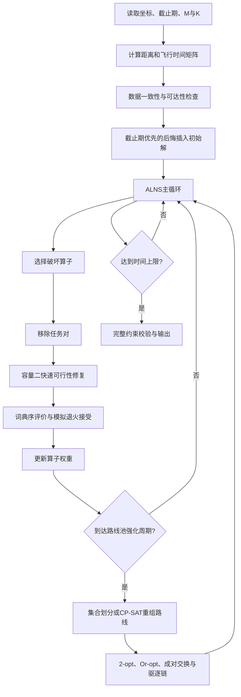

# 低空经济场景下物流无人机调度算法文献研究与设计决策报告

## 执行摘要

根据上传的赛题文件，本报告研究对象并非“未指定问题领域”，而是**低空经济场景下、单次最多携带两件快递的单机与多无人机取送货调度问题**。每项任务包含一个取件点和一个送达点，要求同一任务先取后送、同机完成；无人机载荷不超过两件；单机与集群均不计完成最后一单后的返航里程；每项任务还有最晚送达时间。集群场景进一步限制每架无人机承接任务数不超过 \(K\)，当全部订单按时送达不可行时，应优先提高按时送达任务数，再优化总里程。赛题还要求单机不少于25个任务、集群不少于200个任务，并将求解时间分别控制在约2分钟和4分钟内。

从运筹优化角度，该问题最接近**开放式带时间窗取送货问题**，即 Open Pickup-and-Delivery Problem with Time Windows，简称 Open-PDPTW；集群版本还带有每条路线的任务数上限和软截止期。它同时包含车辆路径、任务配对、先取后送、容量、截止期和任务分配，因此属于典型的 NP-hard 组合优化问题。基于文献证据与赛题规模，最适合参赛的不是单一算法，而是一个分层混合框架：

> **小规模精确动态规划或整数规划用于校验与生成下界；主求解器采用面向容量二的自适应大邻域搜索；集群阶段结合任务分配、后悔插入、驱逐链和路线池集合划分进行强化。**

该选择的主要依据是：经典 ALNS 在超过350个、最大500个请求的基准实例上改进了半数以上的既有最好解；常数时间可行性检查能够显著加速插入操作；混合局部搜索、驱逐搜索与大邻域搜索的算法在354个基准实例中得到142个新最好解；而分支割、列生成和动态规划适合作为小规模最优性验证工具，不适合直接承担200任务、4分钟时限下的全部计算。

本报告最终建议实现一个**词典序多目标、容量二状态感知的混合 ALNS**：

\[
\min \left(\sum_i z_i,\ \sum_i L_i,\ \sum_{k}\sum_{i,j}c_{ij}x_{ij}^{k}\right),
\]

即首先最小化逾期任务数，其次最小化总逾期时间，最后最小化总里程。对于赛题给定的 \(N=200,M=8,K=25\)，因为 \(M K=200=N\)，若所有任务必须完成，则每架无人机实际上必须恰好承接25项任务；这一边界条件应在算法中专门利用。

## 题目界定、示例答案与待确认信息

赛题第一页的示意图给出了两项任务的完整距离。满足先取后送与容量约束的六种拓扑顺序及里程如下：

| 可行访问顺序 | 总里程 |
|---|---:|
| \(0\to1^+\to2^+\to2^-\to1^-\) | **11 km** |
| \(0\to1^+\to2^+\to1^-\to2^-\) | 13 km |
| \(0\to1^+\to1^-\to2^+\to2^-\) | 15 km |
| \(0\to2^+\to1^+\to1^-\to2^-\) | 16 km |
| \(0\to2^+\to1^+\to2^-\to1^-\) | 17 km |
| \(0\to2^+\to2^-\to1^+\to1^-\) | 19 km |

因此示例的最优调度为：

\[
0\rightarrow1^+\rightarrow2^+\rightarrow2^-\rightarrow1^-,
\]

最短里程为 \(5+1+2+3=11\) km。该路径先连续取两件包裹，载荷达到上限2，再依次送达任务2和任务1；最后不返航，符合题意。

赛题可形式化为如下问题。令任务集合为 \(R=\{1,\ldots,n\}\)，任务 \(r\) 的取件点和送达点分别记为 \(r^+\) 与 \(r^-\)，起点为0；距离为 \(c_{ij}\)，速度为 \(v=15\) m/s，因而飞行时间为 \(\tau_{ij}=1000c_{ij}/v\) 秒。每架无人机的访问序列必须满足：

\[
\operatorname{pos}(r^+)<\operatorname{pos}(r^-),\qquad
0\le q_j\le2,
\]

并保证任务的一对取送节点属于同一条路线。对于集群版本，还要求每条路线所含任务数不超过 \(K\)。

赛题存在几项直接影响算法定义和实验公平性的未明确事项。

| 待补充或确认的信息 | 对算法设计的影响 | 本报告采用的暂定处理 |
|---|---|---|
| 单机部分一处写 \(2\le n\le20\)，实验部分又要求不少于25项任务 | 决定能否将指数型精确算法作为主算法 | 按更严格的 \(n\ge25\) 实验要求设计；精确算法只作小规模校验 |
| 最晚送达时间的单位与时间起点 | 影响截止期判定 | 假设从无人机统一出发时刻 \(t=0\) 起计，单位统一为秒 |
| 允许提前到达后等待还是必须立即服务 | 影响时间传播 | 假设可等待，且取送操作耗时为0 |
| “尽可能按时”与总里程的具体优先级 | 不同权重可得到完全不同的方案 | 采用逾期任务数、总逾期时间、总里程的词典序目标 |
| 多架无人机是否必须全部启用 | 影响固定成本和路线数 | 因未设置启用成本，允许空路线；但 \(N=200,MK=200\) 时所有路线均需25项任务 |
| 距离是否满足三角不等式 | 影响剪枝、下界与路线简化 | 坐标数据按欧氏距离计算时满足；任意距离矩阵则先检测 |
| 最晚送达时间是否只约束送达点 | 影响时间窗模型 | 仅约束 \(r^-\)，取件点不设截止期 |
| 是否允许任务逾期但必须全部完成 | 决定不可行解处理 | 集群版本允许逾期但必须完成全部任务 |
| 是否提供完整200任务附件及截止期列 | 决定能否直接计算最终数值结果 | 当前会话仅获得赛题说明文档，尚未获得所述200任务数据文件 |

特别需要指出：上传文档中提到“附件包含200个任务的数据”，但当前可见附件仅包含三页赛题说明，没有200任务坐标与截止期明细。因此本报告能够完成算法与实验方案设计，但不能诚实地给出该200任务实例的最终里程、按时率和具体八条路线。

## 统一数学模型与推荐目标

设无人机集合为 \(V=\{1,\ldots,M\}\)，节点集合为 \(N=\{0\}\cup P\cup D\)，其中 \(P=\{r^+:r\in R\}\)，\(D=\{r^-:r\in R\}\)。令二元变量 \(x_{ij}^k=1\) 表示无人机 \(k\) 从节点 \(i\) 飞到节点 \(j\)，\(y_r^k=1\) 表示任务 \(r\) 分配给无人机 \(k\)，\(t_i^k\) 为到达或开始服务时间，\(q_i^k\) 为离开节点 \(i\) 时的机载包裹数。

任务唯一分配与取送配对可写为：

\[
\sum_{k\in V}y_r^k=1,\qquad
\sum_jx_{r^+j}^k=y_r^k,\qquad
\sum_jx_{r^-j}^k=y_r^k.
\]

路线的流守恒满足：

\[
\sum_jx_{ij}^k=\sum_jx_{ji}^k
\]

对普通服务节点成立。由于赛题不要求返航，建模时可增加一个虚拟终点 \(s\)，令所有服务节点到 \(s\) 的距离为0，不允许从 \(s\) 离开。这样可以直接复用闭合车辆路径模型，同时准确表示“最后一单后不计返航”。

时间传播和载荷传播分别为：

\[
t_j^k\ge t_i^k+\tau_{ij}-H(1-x_{ij}^k),
\]

\[
q_j^k\ge q_i^k+\Delta_j-H(1-x_{ij}^k),
\qquad 0\le q_j^k\le2,
\]

其中取件节点 \(\Delta_{r^+}=1\)，送达节点 \(\Delta_{r^-}=-1\)。先取后送可由同车约束及时间传播保证，也可补充：

\[
t_{r^-}^k\ge t_{r^+}^k+\tau_{r^+,r^-}-H(1-y_r^k).
\]

对于截止期 \(d_r\)，定义逾期时间与逾期指示变量：

\[
L_r\ge t_{r^-}-d_r,\qquad L_r\ge0,\qquad L_r\le H z_r.
\]

推荐采用严格词典序目标：

\[
\min
\left(
Z_1=\sum_r z_r,\ 
Z_2=\sum_rL_r,\ 
Z_3=\sum_{k,i,j}c_{ij}x_{ij}^k
\right).
\]

与简单加权和相比，词典序目标不会出现“少飞若干公里却多造成一个订单逾期”的违背题意现象。工程实现中可直接比较三元组 \((Z_1,Z_2,Z_3)\)，而不必使用数值很大的惩罚系数。若必须交给只支持单目标的求解器，可构造 \(W_1Z_1+W_2Z_2+Z_3\)，但必须确保 \(W_1\) 大于后两项的最大可能变化，\(W_2\) 大于总里程最大可能变化。

单机问题可用三状态编码：每个任务处于“未取、已取未送、已送”三种状态，因此未经容量剪枝的状态规模约为 \(3^n\)。容量只有2会显著减少可达状态，但无法改变指数级最坏复杂度。集群问题则额外包含任务划分，不能直接使用全局动态规划。

## 权威文献与对应算法设计方案

以下被引次数为截至2026年8月5日能够公开核验的数据库快照。不同平台的覆盖范围差异很大，不能把 CitEc、Scopus、出版社页面、CiNii 或第三方聚合数值视为完全可比的统一指标。期刊影响因子采用2026年发布、基于2025引用数据的最新可查指标；对官网未公开引用次数的论文明确标记为“未获得稳定公开数值”，而不是估算。

**Psaraftis：单车三状态精确动态规划**

完整引用：Psaraftis, H. N. (1983). “An Exact Algorithm for the Single Vehicle Many-to-Many Dial-A-Ride Problem with Time Windows.” *Transportation Science*, 17(3), 351–357. DOI: 10.1287/trsc.17.3.351。

被引与期刊水平：CitEc公开页面列出了引用文献，但未提供可稳定复核的总数；期刊 *Transportation Science* 最新JIF为5.0，在运筹与管理科学类别为Q1。

研究问题与假设：研究单车、多对多、带取送时间窗的 Dial-a-Ride 问题，要求每项请求的取送满足时间上下界，目标是最小化完成全部服务所需时间，并判断实例是否可行。它与赛题单机部分高度同构，差异在于赛题只有送达截止期且路线开放。

算法核心：每个任务使用三种状态表示未取、已取和已送，采用前向动态规划。可将状态写为 \((\boldsymbol{\sigma},i,t)\)，其中 \(\boldsymbol{\sigma}\in\{0,1,2\}^n\)，\(i\) 为最后访问节点；从状态中枚举合法的下一取件或送达节点，过滤先取后送、容量和时间窗不合法的转移。赛题实现可将状态标签改为“当前时间、累计里程、逾期三元组”，对同一离散状态执行支配剪枝。

简化伪代码：

```text
DP[初始状态, 0] ← (0个逾期, 0总逾期, 0里程, 时间0)
按已完成操作数递增遍历状态:
    枚举下一节点 j
    若 j 的取送前序、容量和任务状态合法:
        计算新到达时间、逾期量和里程
        若新标签在相同状态下不被支配:
            更新 DP
返回所有任务已送状态中的最优标签
```

复杂度与资源：原文给出的时间复杂度为 \(O(n^2 3^n)\)，内存规模通常为 \(O(n3^n)\)。容量二虽能大幅剪枝，但 \(n=25\) 时仍可能超出两分钟，因此更适合作为 \(n\le15\sim18\) 的最优性校验器，而非最终主算法。

优缺点与适用场景：优点是能证明最优并识别不可行实例，状态定义与赛题容量二结构天然契合；缺点是指数增长、对多机任务划分无能为力。适合生成小规模金标准、评估启发式最优差距以及验证约束实现。

实验与结果：原文主要结论是前向递推在与旧算法相同的 \(O(n^2 3^n)\) 计算量下处理时间窗并识别不可行实例；其年代较早，公开页面未提供现代大规模基准表。

可复现性：INFORMS页面提供论文，DTU研究门户提供最终版本下载；未发现作者维护的现代代码仓库。算法描述短而明确，自行复现难度中等。[期刊原文](https://doi.org/10.1287/trsc.17.3.351)；[DTU版本](https://orbit.dtu.dk/en/publications/an-exact-algorithm-for-the-single-vehicle-many-to-many-dial-a-rid/)

**Ropke 与 Pisinger：自适应大邻域搜索**

完整引用：Ropke, S., & Pisinger, D. (2006). “An Adaptive Large Neighborhood Search Heuristic for the Pickup and Delivery Problem with Time Windows.” *Transportation Science*, 40(4), 455–472. DOI: 10.1287/trsc.1050.0135。

被引与期刊水平：CitEc/EconPapers可查快照约510次引用；*Transportation Science* 最新JIF为5.0，运筹与管理科学Q1。

研究问题与假设：有限同质车辆完成带容量、时间窗、配对和先取后送约束的请求，目标通常先减少车辆数，再减少总距离。它是本赛题最核心的算法母体。

算法核心：ALNS维护当前解和历史最好解，每轮先由“破坏算子”移除一组请求，再由“修复算子”重新插入；算子被选中的概率随历史贡献自适应更新。典型破坏算子包括随机移除、最差成本移除和 Shaw 相关性移除；修复算子包括贪心插入和后悔-\(k\) 插入。较差解可按模拟退火概率接受，以跳出局部最优。

算子权重可按下式更新：

\[
w_h\leftarrow(1-\rho)w_h+
\rho\frac{\pi_h}{u_h},
\]

其中 \(u_h\) 是算子在当前统计区间的使用次数，\(\pi_h\) 为累计得分。较差解的接受概率为：

\[
P_{\mathrm{acc}}=\exp\!\left(-\frac{\Delta f}{T}\right).
\]

复杂度与资源：若每次移除 \(q\) 个任务，朴素计算所有取送位置的插入成本可达 \(O(qn^2)\) 或更高；使用增量时间、载荷和距离评估后，一轮通常可控制在 \(O(qn^2)\)，距离矩阵内存为 \(O(n^2)\)。对 \(n=200\) 的赛题规模，Python中在分钟级执行数万至数十万次局部评估是可行的。

优缺点与适用场景：优点是扩展性强、可自然加入截止期、路线任务数上限和开放路线；缺点是无最优性保证，效果依赖算子、参数和运行时间。它是集群200任务场景最适合的主框架。

实验与关键结果：论文测试了350多个基准实例，最大达到500个请求，并在超过50%的实例上改进当时最好已知解，说明 ALNS 在大规模 PDPTW 上具有很强的质量—时间平衡。

可复现性：论文与技术报告可获得，但未发现作者维护的官方现代代码仓库。算法已成为通用框架，重实现难度中等。[期刊原文](https://doi.org/10.1287/trsc.1050.0135)；[DTU技术报告记录](https://orbit.dtu.dk/en/publications/an-adaptive-large-neighborhood-search-heuristic-for-the-pickup-an/)

**Ropke、Cordeau 与 Laporte：有效不等式强化的分支割算法**

完整引用：Ropke, S., Cordeau, J.-F., & Laporte, G. (2007). “Models and Branch-and-Cut Algorithms for Pickup and Delivery Problems with Time Windows.” *Networks*, 49(4), 258–272. DOI: 10.1002/net.20177。

被引与期刊水平：Wiley页面链接了Web of Science与Google Scholar，但未公开稳定总引用数；*Networks* 当前公开指标约JIF 1.3。引用数据应在有机构权限时由Web of Science再次导出。

研究问题与假设：研究标准 PDPTW 及增加最大乘坐时间约束的 DARP，要求容量、时间窗、任务配对和先取后送均为强约束。

算法核心：构建弧流混合整数模型，并加入连接性、容量、配对、先后顺序和路径结构相关的有效不等式；在分支定界过程中动态分离被违反的割。赛题中可将其改造成开放路线模型，并把逾期变量加入目标。

概念流程为：

```text
建立基础弧流整数模型
求解LP松弛
循环:
    检测子回路、容量、先后顺序等被违反不等式
    加入割并重新求解
若LP解非整数:
    对选定弧变量分支
直至得到整数最优解或达到时间上限
```

复杂度与资源：弧变量约为 \(O(Mn^2)\)，分支割最坏复杂度指数级；时间与内存高度依赖LP松弛强度、割分离效率和求解器。它适合中小规模精确计算，不适合在普通Python解释器中直接求解200任务全模型。

优缺点与适用场景：优点是可给出严格下界和最优性证明，数学模型适合作为论文中的基准模型；缺点是建模规模大、依赖高性能MILP求解器。建议用于 \(n\le10\sim20\) 的验证实例，或在集群算法中对单条路线的小子问题作精确优化。

实验与关键结果：论文在多个 PDPTW 和 DARP 基准集上测试，能够将最多8辆车、96个请求、194个节点的实例求至最优。需要注意，这是专门设计的分支割实现，不意味着直接调用通用求解器即可复现相同规模。

可复现性：数学模型和割族公开，未发现官方代码；完整复现需要实现割分离回调，难度高。[Wiley原文](https://doi.org/10.1002/net.20177)

**Baldacci、Bartolini 与 Mingozzi：集合划分、割与列生成精确算法**

完整引用：Baldacci, R., Bartolini, E., & Mingozzi, A. (2011). “An Exact Algorithm for the Pickup and Delivery Problem with Time Windows.” *Operations Research*, 59(2), 414–426. DOI: 10.1287/opre.1100.0881。

被引与期刊水平：CitEc/EconPapers公开快照约64次；*Operations Research* 最新JIF为3.0，在运筹与管理科学类别为Q2。

研究问题与假设：标准多车 PDPTW，每个可行路线覆盖若干完整请求，主问题从候选路线中选择一组路线，使每项任务恰好被覆盖一次并最小化总成本。

算法核心：采用类似集合划分的主问题；先通过双重上升启发式和割—列生成获得高质量对偶下界，再只保留约化成本足够小、可能改善当前上界的路线。若约化问题规模适中，直接求整数规划；否则使用 branch-cut-and-price 闭合整数间隙。

主问题可概括为：

\[
\min\sum_{p\in\Omega}c_p\lambda_p,
\qquad
\sum_{p\in\Omega}a_{rp}\lambda_p=1,\quad r\in R,
\]

其中 \(\Omega\) 为所有可行路线集合，\(a_{rp}=1\) 表示路线 \(p\) 服务任务 \(r\)。

复杂度与资源：潜在路线数指数级，定价子问题本身是带资源约束的最短路；最坏复杂度仍为指数级。优势在于主问题线性松弛通常很强，可给出高质量下界，但标签集合与路线池可能消耗大量内存。

优缺点与适用场景：优点是精确、下界强，而且“路线池+集合划分”的思想可单独移植到启发式框架；缺点是完整 branch-cut-and-price 实现难度很高。参赛中最值得吸收的并非完整复现，而是：ALNS搜索过程中保存优秀路线，周期性求一个小型集合划分模型重新组合路线。

实验与关键结果：论文在主要文献基准实例上进行了广泛实验，结果表明该方法能够有效缩小上下界并求解一批此前困难的实例；公开摘要没有给出可独立核验的统一最大任务数，因此不宜擅自补写规模数字。

可复现性：论文可获取，未发现官方代码。完整复现难度很高；路线池集合划分的简化版可用 OR-Tools CP-SAT、SCIP 或商业求解器实现。[期刊原文](https://doi.org/10.1287/opre.1100.0881)

**Gschwind 与 Drexl：带摊还常数时间可行性检查的 ALNS**

完整引用：Gschwind, T., & Drexl, M. (2019). “Adaptive Large Neighborhood Search with a Constant-Time Feasibility Test for the Dial-a-Ride Problem.” *Transportation Science*, 53(2), 480–491. DOI: 10.1287/trsc.2018.0837。

被引与期刊水平：INFORMS页面显示被引103次；*Transportation Science* 最新JIF为5.0，运筹与管理科学Q1。

研究问题与假设：同质车辆完成 DARP 请求，约束包括容量、时间窗、最大路线时长和最大乘坐时间，目标最小化路线成本。

算法核心：在每条路线中预维护前向最早到达、后向最晚可行时间、时间松弛、载荷与区间资源摘要。当尝试把一个请求的取件和送达插入既定位置时，利用这些摘要在摊还 \(O(1)\) 时间内判断时间与资源约束是否可行，而不必每次重新扫描整条路线。作者还加入 Balas–Simonetti 路线内邻域和基于历史路线的集合覆盖强化。

对赛题的迁移方式是：由于没有最大乘坐时间，检查会更简单。给定一对取送插入位置，可用前缀最早时间、后缀可延迟量和容量二载荷摘要快速判断可行性。需要区分“单个候选位置检查为 \(O(1)\)”与“枚举一条长度为 \(\ell\) 的路线中所有取送位置仍有 \(O(\ell^2)\) 个候选”。

复杂度与资源：路线摘要更新通常为 \(O(\ell)\)，单个固定插入位置的可行性检查摊还 \(O(1)\)，全位置搜索为 \(O(\ell^2)\)；使用候选邻域和位置剪枝后可以明显降低实际耗时。额外内存为每条路线 \(O(\ell)\)。

优缺点与适用场景：优点是直接攻击 ALNS 最耗时的插入评估，非常适合200任务、分钟级限制；缺点是实现细节复杂，任何摘要更新错误都会造成隐蔽的不可行路线。应配套一个较慢但可靠的完整路线校验器进行断言测试。

实验与关键结果：论文报告该算法在解质量上超过当时先进方法，并在多个基准实例上得到新最好解。加入路线内搜索和路线集合覆盖后效果进一步提升。

可复现性：INFORMS提供在线附录，存在公开工作论文，但未发现作者维护的完整官方代码仓库。可复现性中等偏高。[期刊原文与附录](https://doi.org/10.1287/trsc.2018.0837)；[工作论文记录](https://ideas.repec.org/p/jgu/wpaper/1624.html)

**Curtois 等：局部搜索、适应性引导驱逐搜索与 LNS 混合算法**

完整引用：Curtois, T., Landa-Silva, D., Qu, Y., & Laesanklang, W. (2018). “Large Neighbourhood Search with Adaptive Guided Ejection Search for the Pickup and Delivery Problem with Time Windows.” *EURO Journal on Transportation and Logistics*, 7(2), 151–192. DOI: 10.1007/s13676-017-0115-6。

被引与期刊水平：可查Scopus聚合快照为24次；该期刊最新JIF为2.9，在运筹与管理科学类别为Q2。

研究问题与假设：标准 PDPTW 采用两级目标，首先减少车辆数，其次减少距离。这一目标结构与赛题“先保障按时任务、再缩短里程”的词典序逻辑相似。

算法核心：算法组合三个互补模块。局部搜索负责精细调整路线；LNS通过移除和重插请求改善距离；AGES通过驱逐一个或多个已插入请求，为困难请求腾出位置，并根据历史表现调节驱逐策略。赛题中可将“减少车辆数”的 AGES 改造成“减少逾期任务”：当逾期任务无法直接插入为按时状态时，驱逐一条路线中造成时间阻塞的任务，将它们转移到其他路线或稍后重新插入。

复杂度与资源：取决于驱逐深度、局部邻域和候选列表。朴素一轮可达到 \(O(n^2)\) 至 \(O(n^3)\)，但通过限制驱逐链长度、候选近邻和缓存增量成本可用于千节点级基准。内存通常为 \(O(n^2)\)。

优缺点与适用场景：优点是比单纯 ALNS 更善于修复困难请求和路线数不足的情况，特别适合本赛题 \(M K=N\) 的满负荷分配；缺点是模块多、参数多、调试成本高，深驱逐链可能导致运行时间波动。

实验与关键结果：在354个广泛使用的基准实例中，算法得到142个新最好已知解。对于100节点实例全部达到当时最好值；在更大的400、600、800与1000节点组上分别得到22、33、45与35个新最好解。消融实验表明，移除局部搜索、AGES或LNS任一模块都会显著变差。

可复现性：文章为开放获取，最好解经过验证并发布于SINTEF基准网站；未发现持续维护的官方源代码仓库。由于论文算法描述详细，可复现性中等。[开放获取原文](https://doi.org/10.1007/s13676-017-0115-6)

**吴廷映、王晨秀、孙灏：考虑载重成本的两阶段 ALNS**

完整引用：吴廷映，王晨秀，孙灏．考虑载重成本与时间窗的集送货问题的自适应大邻域搜索算法[J]．工业工程，2023，26(2)：123–131．DOI：10.3969/j.issn.1007-7375.2023.02.014。

被引与期刊水平：期刊官方页面的“Cited by”字段当前未显示数值，不能据此认定为零引用；《工业工程》被国家科技期刊平台标注为OA、CHSSCD和CSTPCD收录，未见JCR影响因子。

研究问题与假设：考虑货物重量对运输成本的影响，构建最小化车辆数和载重相关运输成本的双目标模型；运输成本同时依赖车辆行驶距离和弧上的实际载荷。

算法核心：设计两阶段 ALNS，使用多种破坏与修复算子，并以模拟退火接受准则避免过早陷入局部最优。官方全文给出了相关性移除和后悔插入伪代码。相关性移除先随机选择一个请求，再依据空间或结构相似度扩展被移除请求集合；后悔插入优先处理“现在不插入、未来代价增长最大”的请求。

其载重成本可写成：

\[
C_{\mathrm{load}}
=\sum_{k,i,j}(a\,w_{ij}^k+b)c_{ij}x_{ij}^k,
\]

其中 \(w_{ij}^k\) 是弧 \((i,j)\) 上载荷。虽然赛题暂不考虑电量，该项可作为总里程相同时的节能次级指标，因为无人机携带两件包裹飞行通常比空载或单件载荷消耗更多资源。

复杂度与资源：与一般 ALNS 相近，若采用全位置后悔插入，一轮通常为 \(O(qn^2)\)；载重成本可随插入增量计算，不会改变主复杂度。距离矩阵和候选插入表需要 \(O(n^2)\) 内存。

优缺点与适用场景：优点是中文全文、公式、算子伪代码和实验表均可直接查阅，适合作为参赛论文实现章节的参考；载重成本也体现了无人机物流的物理意义。缺点是目标与赛题不完全一致，且没有公开代码。

实验与关键结果：论文测试了小、中、大不同规模和特征的实例，并分析货物重量、运距系数及运量系数对成本的影响；官方页面包含2幅图和12张表。公开摘要支持“各规模均能有效求解”的定性结论，但在不逐表复算的情况下不宜提炼未经核验的统一提升百分比。

可复现性：期刊官网提供HTML全文、PDF和XML，但未提供代码。中文算法描述完整，自行实现难度中等。[中文官方全文](https://iej.gdut.edu.cn/cn/article/id/gygc_9924)

**Dorling 等：考虑载荷与电池能耗的无人机多航次路径算法**

完整引用：Dorling, K., Heinrichs, J., Messier, G. G., & Magierowski, S. (2017). “Vehicle Routing Problems for Drone Delivery.” *IEEE Transactions on Systems, Man, and Cybernetics: Systems*, 47(1), 70–85. DOI: 10.1109/TSMC.2016.2582745。

被引与期刊水平：第三方学术聚合页面给出约1,070次引用，而CiNii仅记录10次，显示不同数据库覆盖差异极大；该论文可明确视为高影响力方向性工作，但正式提交时应从学校可访问的Web of Science或Google Scholar导出统一口径数字。期刊最新JIF为8.4，两个JCR类别均为Q1。

研究问题与假设：针对无人机配送提出两个多航次VRP模型，允许无人机重复执行航次，并显式考虑载荷重量与电池能耗；一个模型在配送时间上限下最小化成本，另一个在预算约束下最小化总配送时间。

算法核心：先建立载荷与飞行能量之间的近似模型，将其嵌入混合整数规划；再以模拟退火搜索多航次配送方案。邻域操作改变客户顺序、航次划分、无人机复用和电池配置，并通过能耗—成本函数评价候选解。

复杂度与资源：MILP最坏指数级；模拟退火若迭代 \(I\) 次、每次进行 \(O(n)\) 到 \(O(n^2)\) 的路线评估，总复杂度约为 \(O(In)\) 至 \(O(In^2)\)。加入精确能耗计算后常数开销高于纯距离模型。

优缺点与适用场景：优点是无人机领域针对性最强，说明仅优化距离可能产生能量不可行或成本偏高的路线；缺点是原文主要研究从配送中心出发的多航次投递，而赛题是任意取件点到任意送达点，不能直接套用其模型。适合作为赛题扩展、次级指标和答辩中的工程落地依据。

实验与关键结果：数值实验显示，无人机复用与电池容量优化不可忽略；最低成本随允许配送时间增加而下降，总配送时间则随预算增加而下降，呈近似反向指数关系。

可复现性：DBLP和IEEE提供元数据，存在公开预印本记录，但未发现作者维护的正式代码库。能耗模型可复现，完整实验重现难度中高。[IEEE原文](https://doi.org/10.1109/TSMC.2016.2582745)；[arXiv预印本](https://arxiv.org/abs/1608.02305)

## 主要方案横向比较

| 文献 | 方法类型 | 公开可核验被引信息 | 关键性能或结果 | 最适合的赛题用途 | 开源情况 |
|---|---|---:|---|---|---|
| Psaraftis, 1983 | 三状态精确动态规划 | CitEc有引用清单，无稳定总数 | \(O(n^2 3^n)\)，可识别不可行实例 | 单机小规模最优校验、生成金标准 | 论文可下载，无代码 |
| Ropke & Pisinger, 2006 | ALNS | 约510，CitEc | 350多个实例、最大500请求；超过50%实例改进最好解 | 单机25任务和集群200任务的主框架 | 无官方维护代码 |
| Ropke et al., 2007 | 分支割、有效不等式 | 官网未公开稳定总数 | 最多8车、96请求、194节点求至最优 | 精确基准、下界、数学模型 | 无代码 |
| Baldacci et al., 2011 | 集合划分、割与列生成 | 约64，CitEc | 强下界，精确求解主要文献基准 | 路线池重组与小规模精确强化 | 无代码 |
| Gschwind & Drexl, 2019 | ALNS、常数时间插入检查 | 103，INFORMS | 超过当时先进方法，多项新最好解 | 加速后悔插入和大规模搜索 | 有附录，无完整代码 |
| Curtois et al., 2018 | LS + AGES + LNS | 24，Scopus聚合 | 354实例中142个新最好解 | 处理困难截止期任务和满负荷路线 | 论文OA，无官方代码 |
| 吴廷映等，2023 | 两阶段ALNS、载重成本 | 官网未显示数值 | 小中大规模均测试，2图12表 | 中文实现参考、节能次级目标 | HTML/PDF/XML，无代码 |
| Dorling et al., 2017 | 能耗MILP、模拟退火 | 聚合口径约1,070；CiNii为10 | 揭示复用、电池和载荷能耗的重要性 | 无人机工程扩展与答辩论证 | 有预印本，无官方代码 |

综合比较后，建议将算法职责分为三层：

| 层次 | 推荐算法 | 原因 |
|---|---|---|
| 精确验证层 | 三状态DP、CP-SAT或小规模MILP | 为 \(n\le15\sim18\) 提供最优值，发现约束或增量计算错误 |
| 主搜索层 | 词典序、容量二状态感知 ALNS | 能在25至200任务规模和分钟时限内提供高质量解 |
| 强化层 | 驱逐链、路线池集合划分、路线内动态规划 | 修复困难逾期任务并重新组合搜索中发现的优秀路线 |

不建议将遗传算法、蚁群算法或粒子群算法单独作为主算法。它们当然可以求解，但对“取送成对、先取后送、载荷二、截止期和路线任务上限”的可行性维护通常比 ALNS 更困难；同时，ALNS已有大量直接面向 PDPTW 的高质量证据。

## 推荐技术路线与算法创新方向

推荐算法命名可采用：

> **C2-Lex-HALNS：Capacity-2 Lexicographic Hybrid Adaptive Large Neighborhood Search**

其中 C2 表示针对容量二的状态结构，Lex 表示词典序截止期目标，H 表示路线池与精确子问题混合强化。



核心伪代码如下：

```text
输入任务、无人机数 M、容量 Q=2、任务上限 K、时间上限
预计算距离矩阵与飞行时间矩阵
S ← Deadline-Regret-Insertion()
S_best ← S
初始化破坏/修复算子权重与温度 T

while 未达到墙钟时间上限:
    d ← 按权重选择破坏算子
    r ← 按权重选择修复算子
    R_removed ← d(S)
    S' ← r(S \ R_removed)

    对 S' 执行容量二快速可行性验证
    必要时执行有限深度驱逐链修复

    若 score(S') 词典序优于 score(S):
        接受 S'
    否则以基于标量化差值的模拟退火概率接受

    若 score(S') 优于 score(S_best):
        S_best ← S'
        保存其中各条路线到路线池

    更新算子得分和选择概率

    若到达强化周期:
        用路线池求集合划分/CP-SAT模型
        对得到的解执行路线内局部搜索

对 S_best 做独立完整校验
输出路线、里程、送达时间、逾期任务与运行日志
```

建议至少实现下列八类破坏算子：随机移除、最差距离移除、最差逾期贡献移除、空间相关移除、截止期相关移除、同路线片段移除、满负荷冲突移除、整条路线部分清空。修复算子至少包括贪心插入、后悔-2、后悔-3、最早截止期插入、逾期优先插入和有限驱逐链插入。ALNS使用多算子自适应竞争正是经典方法取得大规模效果的关键。

可形成论文创新点的方向如下。

| 创新方向 | 核心创新 | 预期优势 | 潜在风险 | 实现难度 |
|---|---|---|---|---|
| 词典序软截止期评价 | 直接比较“逾期数—总逾期—里程”三元组，而非人工加权和 | 与题目“优先保障更多任务”严格一致；参数更少 | 模拟退火需要定义合理的标量差值 | 低 |
| 容量二载荷状态自动机 | 将路线载荷模式限制为0、1、2，并预计算合法局部转移 | 大幅减少不可行插入评估；突出赛题特有约束 | 代码过度专用，未来容量变化需重构 | 中 |
| 截止期—空间联合相关性移除 | 相关度同时考虑取送位置、截止期差、当前路线和时间松弛 | 能成组重排相互阻塞的任务，改善按时率 | 相关度权重不当会降低多样性 | 中 |
| 路线池集合划分强化 | 保存搜索产生的优秀完整路线，周期性精确重组 | 利用历史信息跨越局部最优，常能直接降低总里程 | 路线池过大时模型膨胀；需控制去重 | 中高 |
| 逾期任务驱逐链 | 为难插入的紧急任务驱逐一至数个低紧迫任务，再递归安置被驱逐任务 | 对 \(MK=N\) 的满负荷集群特别有效 | 深度过大造成运行时间不稳定 | 中高 |
| 双层分解：任务分配与路线优化协同 | 上层在无人机间交换任务，下层精确或启发式优化单条路线 | 降低一次搜索全部弧变量的难度，便于并行 | 过早固定分配可能错失跨路线改进 | 中 |
| 在线多臂赌博机选算子 | 根据当前逾期率、路线松弛和搜索阶段在线选择算子，而非只看长期平均 | 不需要离线训练，可适应不同难度实例 | 奖励延迟、探索参数敏感 | 高 |
| 载重—距离能耗次级指标 | 在逾期和总里程相同时，最小化载荷乘距离或估算能耗 | 增强无人机工程合理性和论文创新性 | 赛题未要求能耗，不能喧宾夺主 | 低至中 |
| 不确定速度下的鲁棒截止期 | 对风速或飞行时间扰动设置安全缓冲或情景评估 | 提高实际落地可信度，可作为扩展实验 | 增加模型规模，可能偏离竞赛评分 | 中高 |

其中最值得优先实现的五项是：**词典序评价、容量二快速检查、截止期联合移除、逾期驱逐链和路线池集合划分**。这五项与题目高度相关，不需要机器学习训练数据，能够在有限开发周期内形成清晰、可解释、可消融验证的创新链条。

容量二快速检查可设计为每条路线维护以下摘要：各位置的最早到达时间、后缀可吸收延误量、当前位置载荷、区间最大载荷、任务数和截止期余量。固定一对取送插入位置后，只需计算新增弧距离、传播延迟和两个新增载荷事件；若传播延迟不超过后缀松弛且区间最大载荷不超过2，则候选可行。这一设计直接借鉴常数时间可行性检查思想，但针对赛题没有乘客乘坐时间、容量固定为2的特点进行简化。

多机初始解建议采用两阶段构造。首先按“最晚送达时间—直接服务最短时间”的紧迫度排序；其次对每项任务计算插入所有无人机路线的词典序增量，并采用后悔-2或后悔-3规则。对于 \(N=200,M=8,K=25\)，在构造后期必须加入剩余槽位约束：若某条路线剩余容量与剩余任务数匹配，则禁止不合理地继续占用其他路线的槽位，避免最终任务无处插入。

## 实验设计、复杂度控制与复现安排

实验应同时回答四个问题：算法是否可行、解质量是否优于简单基线、运行时间能否满足限制、各创新模块是否真正有效。

建议测试集分为三类。第一类为小规模精确校验集，任务数取 \(n=5,8,10,12,15,18\)，由DP或CP-SAT求最优。第二类为单机压力集，任务数取 \(n=20,25,30,40\)，用于验证两分钟时限。第三类为集群集，设置 \(N=50,100,150,200\)，并在最终配置中使用 \(M=8,K=25,v=15\) m/s。标准 PDPTW 文献基准也可用于证明算法具有一般性，但需将闭合路线改为开放路线，并将车辆容量统一调整为2。经典文献普遍使用数百请求的PDPTW基准验证ALNS与混合搜索，这为该规模设计提供了直接依据。

模拟坐标必须满足任意节点对距离均为1–12 km。不能简单在一个大正方形中独立均匀采样，因为会出现距离小于1 km或大于12 km的点对。可采用拒绝采样：

1. 在直径不超过12 km的区域内生成候选点；
2. 只有当候选点与现有所有点距离均不小于1 km时才接受；
3. 生成完成后再次验证所有点对；
4. 若节点数量较多导致空间拥挤，可放宽为题目更可能意指的“距离矩阵元素截断到1–12 km”，但必须在论文中说明，不能静默修改数据。

若自行生成截止期，可先计算任务单独直送的理论最早完成时间：

\[
e_r=\tau_{0,r^+}+\tau_{r^+,r^-},
\]

再设置：

\[
d_r=e_r+s_r,
\]

其中松弛量 \(s_r\) 可按紧、适中、宽松三类分布采样。例如紧截止期采用较小分位数，宽松截止期采用较大分位数。这样可以系统生成不同可行难度，而不是任意给出截止期。

对比方法建议至少包括：

| 对比算法 | 作用 |
|---|---|
| 最近邻可行贪心 | 最低实现门槛基线 |
| 最早截止期优先加贪心插入 | 检验单纯强调截止期的效果 |
| 后悔-2构造算法 | 检验主算法是否不仅依靠高质量初始解 |
| 基础ALNS | 去除所有容量二、驱逐链和路线池创新 |
| C2-Lex-HALNS | 完整推荐算法 |
| 小规模DP或CP-SAT | 给出最优值和启发式最优差距 |

主要评价指标应按优先级报告：

\[
\text{OnTimeRate}
=\frac{\#\{r:t_{r^-}\le d_r\}}{n},
\]

以及逾期任务数、总逾期时间、最大逾期时间、总里程、最大单机里程、运行时间、小规模最优差距和多随机种子标准差。由于目标是词典序的，不应仅报告一个混合“目标函数值”，否则读者无法判断算法究竟改善了时效还是里程。

消融实验至少包含：移除截止期相关算子、移除容量二快速检查、移除驱逐链、移除路线池重组、将词典序改为固定权重、关闭模拟退火。Curtois等的实验已经表明，局部搜索、驱逐搜索和LNS三个组件具有互补性，因此本项目也需要用消融实验验证每个模块的独立贡献。

预期复杂度可按下表说明。

| 模块 | 典型时间复杂度 | 内存需求 | 适用规模 |
|---|---:|---:|---|
| 完整三状态DP | \(O(n^2 3^n)\) | \(O(n3^n)\) | 单机小规模 |
| 弧流MILP | 最坏指数级，变量约 \(O(Mn^2)\) | 至少 \(O(Mn^2)\) | 精确基准 |
| 一次朴素后悔插入 | \(O(Mn^3)\) 的保守上界 | \(O(n^2)\) | 中等规模 |
| 带缓存和候选剪枝插入 | 通常接近 \(O(Mn^2)\) | \(O(n^2)\) | 25至200任务 |
| ALNS主循环 | 约 \(O(Iqn^2)\) | \(O(n^2+|\Omega|)\) | 主要生产算法 |
| 路线池集合划分 | 最坏指数级，但变量为受控路线池大小 | \(O(|\Omega|n)\) | 周期性短时强化 |

其中 \(I\) 为迭代数，\(q\) 为每次移除任务数，\(|\Omega|\) 为路线池大小。实际运行中应以墙钟时间而非固定迭代数终止：单机可设置110秒主搜索加10秒验证与输出，集群可设置220至230秒主搜索加剩余时间进行路线池重组和最终校验。这样更符合赛题的两分钟、四分钟要求。

为保证结果可复现，建议采用 Python 3.11，核心数据结构使用 NumPy；热点插入评估可选择 Numba，但应提供无Numba降级版本。小规模精确求解和路线池重组优先使用开源 OR-Tools CP-SAT 或 SCIP，避免商业许可证影响复现。代码仓库应至少包含：

| 文件或目录 | 内容 |
|---|---|
| `data/` | 原始数据、模拟数据和字段说明 |
| `solver/model.py` | 任务、节点、路线和目标定义 |
| `solver/initial.py` | 初始解构造 |
| `solver/operators.py` | 所有破坏与修复算子 |
| `solver/alns.py` | 主搜索循环与权重更新 |
| `solver/exact.py` | 小规模DP或CP-SAT校验器 |
| `solver/validator.py` | 独立完整约束校验 |
| `experiments/` | 批量运行、消融和规模实验脚本 |
| `configs/` | 所有参数、时间上限和随机种子 |
| `results/` | 路线、指标、日志和汇总表 |
| `README.md` | 环境、命令、输入输出格式与复现实例 |

每次运行应保存随机种子、硬件、Python及依赖版本、开始结束时间、各算子使用次数、接受次数、最好解发现时刻和完整路线。最终解必须交给独立验证器重新计算，而不能复用搜索中的增量缓存；验证器应检查每个任务恰好出现一次、取件先于送达、取送同机、载荷始终在0至2之间、每架任务数不超过 \(K\)、送达时间和总里程计算一致。

在论文结果中，小规模实例报告“最优值—算法值—相对差距”，大规模实例至少运行10个随机种子，报告最好值、均值、标准差和95%置信区间。最终200任务实例则可在规定时限内进行多进程独立搜索，最后选择词典序最优解；但必须确认竞赛是否允许使用多核，否则单核和多核成绩应分别报告。

从算法设计决策看，最稳妥的提交版本是：**以ALNS为主体，以容量二快速可行性检查为速度创新，以截止期驱逐链为质量创新，以路线池集合划分为混合优化创新，以小规模动态规划或CP-SAT为正确性保障**。这一组合既有经典高被引文献支撑，又能针对赛题特有的载荷二、开放路线、软截止期和 \(M K=N\) 满负荷条件形成清晰的原创改进链。
